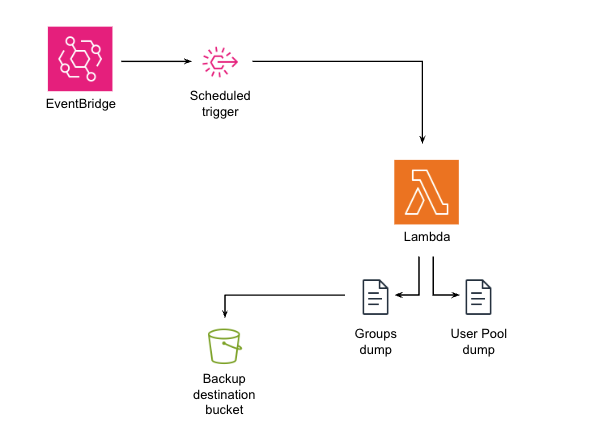

# RASD backups

This component contains the infrastructure and code for the automated backups of the RASD Cognito user pool data

The backup process consists of a scheduled EventBridge rule that triggers a Lambda that will export the user pool users and groups. These are then copied to S3. Backups are done daily, the amount of time to keep daily and weekly backups is also set in the configuration file.

