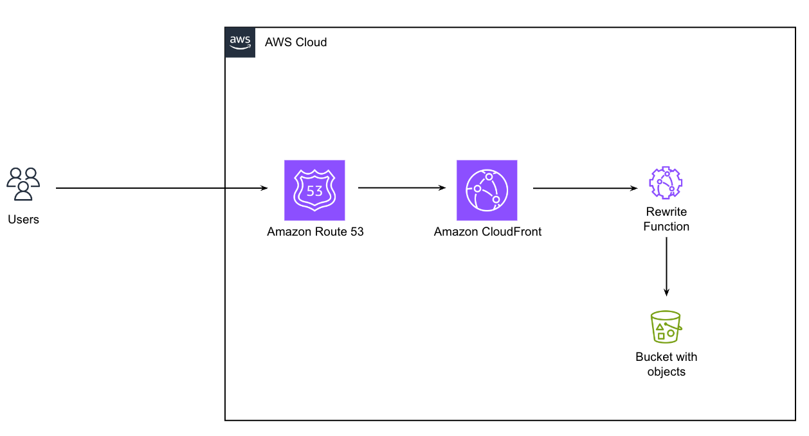

# RASD static site and assets

This component contains the infrastructure and code to launch and develop the RASD static site.

## Architecture

The RASD static site consists of a number of components:
- A private S3 bucket with bucket policy to store the static site assets
- A CloudFront distribution with cache policy to serve the site
- A CloudFront function to rewrite the URL to the index.html file
- Domain names registered in Route53 for the base location ( rasd.org.au ) and subdomains ( www.rasd.org.au )

and

- A CodePipeline with associated resources to build and deploy the site

The RASD frame work site is completely static, all assets are stored in an S3 bucket. The bucket is not publicly accessible and is configured to only take requests from the CloudFront distribution. The CloudFront distribution is https only, any http requests will be redirected. It uses the S3 bucket as an origin. There is a CloudFront function that rewrites any urls without a file name to use the index.html file. The distribution supports http2, it uses the common ACM certificate in the account that it's launched in, the ARN for that is specified in the config file. The certificate is in the us-east-1 region as required by CloudFront

--- 

## RASD Static Site Editing Guide

To make changes to the RASD static site, follow these steps:

### Building Pipeline with Quarto

The site’s building pipeline is set up using **Quarto** to render source files. The Quarto has a [metadata](https://quarto.org/docs/projects/quarto-projects.html#project-metadata) stored in [quarto.yml](quarto-source-files/_quarto.yml). The building phase is deployed on AWS, and changes of the content should be made in the [quarto-source-files](quarto-source-files) directory.

### Steps to Edit and Preview:

1. **Editing Source Files:**  
   Modify any content within the [quarto-source-files](quarto-source-files) directory. This directory contains the source files necessary to generate the static site.

2. **Quarto Version:**  
   The Quarto version used for builds is specified in the [config.ini](config.ini) file under the variable `QUARTO_VERSION`. It is recommended to use the same version locally for consistent builds.

3. **Local Preview:**  
   You can render and [preview](https://quarto.org/docs/websites/#quick-start) Quarto files locally using your local installation of Quarto. This allows you to preview changes before committing them.

4.	**Pushing Changes:**  
    Once satisfied with your local changes, push them to the repository. Site builds on AWS will use predefined Quarto build environment to ensure consistency. This environment is configured based on the Quarto Version.